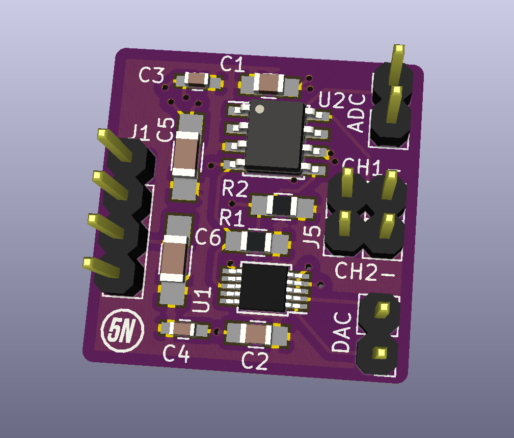

# ADC-DAC-16bit

Released under CC-BY-SA 4.0 license  

### Project status
At this time, the board is mounted and waiting to be tested 

### Project description 
An easy and cheap board to prototypate with two dual channel 16 bit A/D and D/A converters.  
Makes use of I2C to communicate with a microcontroller, see the datasheets for reference.  
Drawn in KiCAD.

Makes use of:
* **MCP3426** 16 bit ADC, dual channel, differential
* **AD5667R** 16 bit DAC, dual channel (the R at the end is important)
* 2 100nF 0603 capacitors
* 2 100nF 0805 capacitors
* 2 10uF  1206 capacitors
* 2 4k7   0805 resistors  

But look how cute it is  

